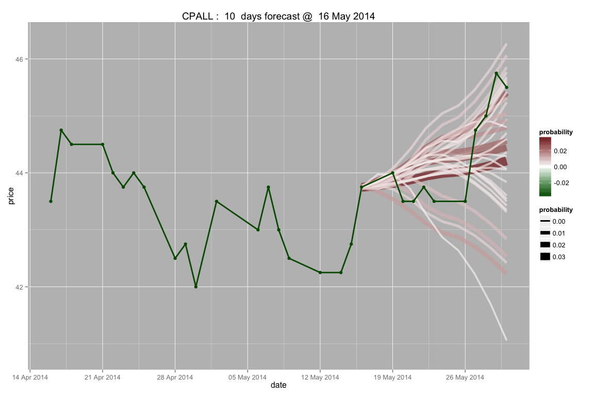

# Hidden Markov Models SET prediction
npc  


## Train general model 
from SET, SET50 and SET 100

HMM states mean

```
## 
## Model:
## ------
## 5 states HMM with 4-d gaussian distribution
## 
## Initial probabilities:
##            Pi 1          Pi 2          Pi 3        Pi 4 Pi 5
##   2.138328e-219 1.427029e-134 3.042102e-102 8.33869e-74    1
## 
## Transition matrix:
##            State 1    State 2      State 3      State 4    State 5
## State 1 0.81955398 0.00000000 1.435487e-01 5.256544e-86 0.03689730
## State 2 0.00000000 0.88040887 9.832047e-42 5.248862e-02 0.06710251
## State 3 0.02900390 0.00000000 8.742935e-01 2.293789e-09 0.09670261
## State 4 0.00000000 0.08815414 7.936899e-02 8.219543e-01 0.01052260
## State 5 0.01730508 0.01752782 4.768239e-02 2.244789e-01 0.69300578
## 
## Conditionnal distribution parameters:
## 
## Distribution parameters:
##   State 1
##              mean   cov matrix                                      
##      -0.008753989 0.0012670281 0.0005363515 0.0010481035   0.2276022
##      -0.008958601 0.0005363515 0.0007088900 0.0006757593   0.1504061
##      -0.009387141 0.0010481035 0.0006757593 0.0014019474   0.2391104
##      29.602371768 0.2276022438 0.1504061185 0.2391103798 102.6077234
## 
##   State 2
##              mean   cov matrix                                      
##       0.005551787 9.591653e-05 5.914863e-05 4.920621e-05  0.03290556
##       0.005852761 5.914863e-05 7.944959e-05 6.332126e-05  0.02633131
##       0.005720794 4.920621e-05 6.332126e-05 8.730322e-05  0.02862060
##      77.198513270 3.290556e-02 2.633131e-02 2.862060e-02 52.03451593
## 
##   State 3
##              mean   cov matrix                                      
##      -0.003505185 1.408343e-04 7.037164e-05 1.027660e-04  0.05242800
##      -0.003743405 7.037164e-05 1.048008e-04 9.142937e-05  0.04271595
##      -0.003612510 1.027660e-04 9.142937e-05 1.289677e-04  0.04964382
##      36.798261642 5.242800e-02 4.271595e-02 4.964382e-02 85.06497689
## 
##   State 4
##              mean   cov matrix                                      
##       0.001038035 5.916249e-05 3.038820e-05 3.645796e-05  0.03209113
##       0.001118487 3.038820e-05 4.393827e-05 3.914250e-05  0.02559045
##       0.001399822 3.645796e-05 3.914250e-05 5.148545e-05  0.02815439
##      60.368871071 3.209113e-02 2.559045e-02 2.815439e-02 55.90160042
## 
##   State 5
##              mean   cov matrix                                      
##       0.003683993 0.0003221639 0.0001953530 0.0001987954  0.07319049
##       0.003658972 0.0001953530 0.0002753592 0.0002154122  0.06831290
##       0.003320892 0.0001987954 0.0002154122 0.0002790547  0.06804130
##      57.240690260 0.0731904865 0.0683129002 0.0680412962 71.17414478
```

## States plot
Estimate price states from Hidden Markov model distribution.
 

Apply states from general model to DTAC
 

## Simulate SET future price based on general model
Lines color and size represent probability weight.
Dark brown is hightest, white is lowest.
Green line is actual price.
     
